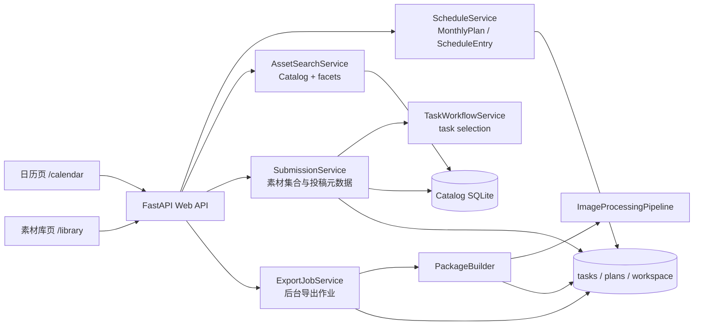

# Publishing Workspace 双页面与投稿导出设计

## 1. 文档信息

- 文档版本：v1
- 状态：设计已确认，待编写实现计划
- 目标项目：`refactor/tools/publishing_workspace`
- 适用范围：本地单机 Publishing Workspace Web 应用

## 2. 背景

当前 Publishing Workspace 已经具备以下能力：

- Catalog 素材索引和图片预览；
- artist、character、action_group、action 节点筛选；
- 从 action 节点读取 `classify.yaml` 并提供多维 facet 筛选；
- 月度计划和投稿日期调整；
- task 的 `all`、`post`、`cover` 三个选择集合；
- PNG 参数清理、mosaic 自动打码、目录输出、ZIP 打包；
- 任务构建记录和 build manifest。

目前这些能力集中在一个日历页面中，导致日历、素材检索、投稿编辑和导出操作彼此耦合。下一阶段拆分为两个独立页面：

1. **日历页**：只负责调整投稿日期和时间，以及查看投稿安排。
2. **素材库页**：负责检索素材、瀑布流浏览、创建/编辑投稿、导出投稿包。

两个页面共享同一套后端服务和持久化数据，不复制图片处理和打包逻辑。

## 3. 目标

### 3.1 功能目标

- 将日历和素材库拆成两个独立入口；
- 素材库保留现有多维节点筛选和 `classify.yaml` facet 筛选；
- 素材结果使用瀑布流展示，并支持滚动分页加载；
- 右侧展示历史投稿，支持打开已有投稿继续编辑；
- 从瀑布流选择图片并保存为投稿；
- 保存投稿时立即创建或更新持久化 task；
- 每个投稿支持启动导出流水线；
- 导出页面显示处理阶段和进度；
- 导出完成后可以打开导出目录；
- 继续复用既有 PNG 参数清理、mosaic、ZIP 和 build manifest 能力；
- 不破坏旧 task、旧 API 和旧 `inline_selection` 月度计划。

### 3.2 非目标

本次不包含：

- Pixiv 自动投稿；
- 自动排期或推荐排期；
- 复制投稿功能；
- 新的图片清理或打码算法；
- SD/WebUI、ComfyUI 等新的生图接入；
- 把 Catalog、旧提示词库或图片源迁移到新格式；
- 将所有旧 `inline_selection` 计划一次性迁移为 task；
- 多用户权限和远程队列。

## 4. 设计原则

1. 页面只负责交互，业务规则放在 service 层。
2. 素材选择使用 `asset_id`，不把文件路径作为页面的稳定身份。
3. task 是实际打包流水线的输入，`PackageBuilder` 不知道 Web 页面。
4. 日历只管理 `MonthlyPlan` 和 `ScheduleEntry` 的时间关系。
5. 新增 API 使用独立命名空间，保留旧 API 兼容脚本。
6. 保存和导出都是可恢复的持久化操作，不能只依赖浏览器内存。
7. 进度是实际流水线进度，不用固定延时或假进度。

## 5. 总体架构



### 5.1 页面职责

#### 日历页 `/calendar`

- 月份切换；
- 查看每天的投稿卡片；
- 修改投稿日期和时间；
- 打开素材库编辑指定投稿；
- 查看投稿是否已经导出；
- 不负责素材筛选和图片集合编辑。

#### 素材库页 `/library`

- import 选择；
- artist、character、action_group、action 筛选；
- `classify.yaml` facet 筛选；
- 瀑布流素材浏览和分页；
- 历史投稿列表；
- 新建/编辑 Submission；
- 导出投稿和查看导出进度。

### 5.2 路由

```text
/          -> 日历页，保持现有入口兼容
/calendar  -> 日历页
/library   -> 素材库页
```

日历跳转素材库时使用：

```text
/library?submission_id=<task_id>
```

## 6. 核心概念和生命周期

### 6.1 Submission

`Submission` 是素材库中的业务对象，表示一次准备投稿的图片集合和标题。

第一版中 `submission_id` 与 `task_id` 使用同一个值，避免维护两个需要同步的身份系统。

```text
Submission
  └── task_id / submission_id
        ├── task.yaml
        ├── submission.yaml
        ├── selection/all
        ├── selection/post
        ├── selection/cover
        └── builds
```

### 6.2 task

task 是现有打包流水线的输入，继续由 `TaskConfig` 描述：

- task 标题；
- processing profile；
- PNG 参数清理操作；
- mosaic 操作和适配器配置；
- 目录输出和 ZIP 输出配置。

`PackageBuilder` 只读取 task 目录，不读取 `Submission` 页面状态。

### 6.3 MonthlyPlan

`MonthlyPlan` 只保存投稿什么时候发布：

```yaml
entries:
  - entry_id: entry-001
    scheduled_at: 2026-09-05T20:00:00+08:00
    title: Homura 足部图集
    content:
      kind: task
      task_id: homura-foot-001
```

新的素材库投稿保存后，日历新建或更新 `TaskContent` 引用。日历不复制图片，不把图片路径写进计划。

### 6.4 保存投稿生命周期

```text
用户在瀑布流选择 asset_id
  -> 右侧 Submission 编辑器维护 all/post/cover 顺序
  -> 点击保存
  -> 校验 asset_id 和文件可读性
  -> 自动补齐 post / cover
  -> 创建或更新 task.yaml
  -> 创建或更新 submission.yaml
  -> 按 asset_id 顺序物化 selection 目录
  -> 返回 submission + task 摘要
```

保存时的集合规则：

- `post` 为空且 `all` 非空：`post = all`；
- `cover` 为空且 `post` 非空：`cover = [post[0]]`；
- `all` 为空：拒绝保存，返回具体错误；
- `post`、`cover` 不强制必须是 `all` 的子集，沿用当前打包层的 warning 语义；
- 同一个集合内重复 `asset_id` 自动去重并保留首次出现顺序。

### 6.5 导出生命周期

```text
点击导出
  -> 创建 queued ExportJob
  -> 后台线程运行
  -> validate
  -> process（PNG 清理 / mosaic）
  -> archive（ZIP）
  -> finalize（manifest / build 目录）
  -> completed 或 failed
```

同一个 task 同时只能存在一个 `queued` 或 `running` 作业。已完成作业可以再次导出，失败作业可以重新发起。

## 7. 持久化结构

### 7.1 目录结构

```text
<publishing-root>/
├── tasks/
│   └── <task_id>/
│       ├── task.yaml
│       ├── submission.yaml
│       ├── selection/
│       │   ├── all/
│       │   ├── post/
│       │   └── cover/
│       └── builds/
├── plans/
│   └── YYYY-MM/
│       ├── plan.yaml
│       └── executions/
└── workspace/
    └── state/
        └── export_jobs/
            └── <job_id>.json
```

### 7.2 `submission.yaml`

```yaml
schema: publishing-workspace.submission/v1
submission_id: homura-foot-001
task_id: homura-foot-001
title: Homura 足部图集
revision: 3
source_import_id: import-20260820
sets:
  all:
    - sha256:aaa...
    - sha256:bbb...
  post:
    - sha256:aaa...
  cover:
    - sha256:aaa...
created_at: 2026-08-20T12:00:00+00:00
updated_at: 2026-08-20T12:10:00+00:00
last_export:
  job_id: export-001
  build_id: 20260820_121100_a1b2c3
  status: completed
  output_dir: C:/publish/tasks/homura-foot-001/builds/20260820_121100_a1b2c3
```

字段约束：

- `submission_id`、`task_id` 必须与 task 目录名一致；
- `revision` 从 1 开始，每次成功保存递增；
- `sets` 保存 `asset_id`，不保存页面临时序号；
- `last_export` 仅是展示摘要，完整状态以 ExportJob 文件为准；
- `source_import_id` 可以为空，用于旧 task 或跨 import 选择。

### 7.3 旧 task 兼容

旧 task 没有 `submission.yaml` 时：

1. 从 `task.yaml` 读取标题和处理配置；
2. 扫描 `selection/all|post|cover`；
3. 用文件内容 SHA-256 映射 Catalog 的 `asset_id`；
4. 可以展示为历史投稿并继续导出；
5. 用户第一次保存后再补写 `submission.yaml`。

不执行全量迁移，不修改旧 task 的图片文件。

## 8. 后端模块

### 8.1 `submissions/models.py`

定义：

- `Submission`；
- `SubmissionSet`；
- `SubmissionSummary`；
- 投稿 revision 冲突使用的错误数据。

`Submission` 的集合字段统一使用 `dict[SelectionName, list[str]]`，与现有 `InlineContent` 保持相同的 `all/post/cover` 语义。

### 8.2 `submissions/repository.py`

负责：

- 读取和保存 `submission.yaml`；
- 原子替换；
- revision 检查；
- 扫描 `tasks/*` 构建历史投稿列表；
- 为旧 task 生成兼容摘要。

不负责：

- 读取 Catalog；
- 图片复制；
- 调用打包器。

### 8.3 `submissions/service.py`

负责：

- 校验 asset 是否存在和可读取；
- 从 Catalog 资产构建 `SelectionSet`；
- 创建/更新 `TaskConfig`；
- 调用 `SelectionMaterializer` 物化集合；
- 生成和保存 `submission.yaml`；
- 返回历史投稿和计划使用情况。

保存过程中任何集合失败都不提交半成品：先写入临时目录，再原子替换集合目录和 YAML；已有 task 的旧集合和旧 build 必须保留到新状态成功提交后。

### 8.4 `plans/search.py`

扩展 `AssetSearchFilter`：

```python
offset: int = 0
limit: int = 60
```

新增 `AssetPageResult`：

```python
class AssetPageResult(BaseModel):
    schema_id: str
    items: list[AssetSearchResult]
    offset: int
    limit: int
    has_more: bool
    next_offset: int | None
```

搜索必须先完成筛选，再按稳定顺序分页。稳定排序使用：

```text
source_order -> display_name.casefold() -> asset_id
```

不能使用每次扫描的无序 SQLite 返回顺序作为分页顺序。总数不是必需字段，避免每次滚动都计算总数。

### 8.5 `export_jobs/`

定义：

- `ExportJob`；
- `ExportJobRepository`；
- `ExportJobService`；
- `BuildProgress` 到 JSON 状态的转换。

作业状态：

```text
queued | running | completed | failed | interrupted
```

作业字段至少包含：

```json
{
  "job_id": "export-001",
  "task_id": "homura-foot-001",
  "status": "running",
  "phase": "process",
  "processed": 12,
  "total": 24,
  "percent": 50,
  "current_selection": "post",
  "current_filename": "001.png",
  "build_id": null,
  "output_dir": null,
  "error": null,
  "created_at": "...",
  "updated_at": "..."
}
```

`PackageBuilder` 增加可选进度回调，默认不传回调时行为不变。ExportJobService 不复制 PackageBuilder 的处理逻辑。

服务启动时扫描 `workspace/state/export_jobs/*.json`：

- `queued` 或 `running` 作业如果没有当前执行线程，标记为 `interrupted`；
- 不自动重跑；
- 页面允许用户重新点击导出。

## 9. Web API

### 9.1 素材分页

```http
GET /api/library/assets
```

查询参数：

- `import_id`；
- `text`；
- `artist`；
- `character`；
- `action_group`；
- `action`；
- `facets`：JSON 对象；
- `offset`：默认 0；
- `limit`：默认 60，最大 200。

响应：

```json
{
  "schema": "publishing-workspace.asset-page/v1",
  "items": [
    {
      "asset_id": "sha256:aaa...",
      "path": "G:/images/a.png",
      "display_name": "a.png",
      "values": {
        "artist": ["20260412"],
        "character": ["akemi_homura"]
      },
      "facets": {
        "subtype": ["foot"]
      },
      "usage": []
    }
  ],
  "offset": 0,
  "limit": 60,
  "has_more": true,
  "next_offset": 60
}
```

旧 `/api/assets/search` 保留，继续返回数组，供旧页面和脚本使用。

### 9.2 投稿列表和详情

```http
GET /api/submissions
GET /api/submissions/{task_id}
POST /api/submissions
PUT /api/submissions/{task_id}
```

列表响应包含：

- `submission_id`；
- `task_id`；
- `title`；
- `counts`；
- `updated_at`；
- `scheduled_entries`；
- `last_export`。

创建请求：

```json
{
  "title": "Homura 足部图集",
  "source_import_id": "import-20260820",
  "sets": {
    "all": ["sha256:aaa...", "sha256:bbb..."],
    "post": [],
    "cover": []
  }
}
```

更新请求额外携带：

```json
{
  "revision": 2
}
```

revision 不匹配返回 `409 submission_revision_conflict`，避免两个页面覆盖彼此的修改。

### 9.3 导出作业

```http
POST /api/submissions/{task_id}/exports
GET  /api/export-jobs/{job_id}
GET  /api/submissions/{task_id}/exports
POST /api/export-jobs/{job_id}/open-output
```

启动导出：

- 如果 task 有活动中的 `queued/running` job，返回该 job，不重复启动；
- 否则创建新 job 并立即返回 `202`；
- 页面按 1 秒间隔轮询，job 完成或失败后停止轮询。

打开目录：

- 只能打开 workspace 内已有的 build 输出目录；
- 后端重新校验目录存在性和路径归属；
- Windows 使用系统文件管理器；
- 非 Windows 或无桌面环境返回明确的不可用错误和目录路径。

### 9.4 日历兼容

保留现有接口：

```http
GET    /api/plans/{month}
POST   /api/plans/{month}/entries
PUT    /api/plans/{month}/entries/{entry_id}
PATCH  /api/plans/{month}/entries/{entry_id}/date
DELETE /api/plans/{month}/entries/{entry_id}
```

新投稿统一使用 `TaskContent`。旧 `InlineContent` 继续可读、可移动日期、可删除；不进行隐式全量迁移。旧 inline 条目进入素材编辑时，采用显式的懒转换：只有用户确认保存时才创建 task 并把 entry 更新为 `TaskContent`。

## 10. 前端设计

### 10.1 共享导航

两个页面顶部显示：

- `日历` 链接；
- `素材库` 链接；
- 当前 workspace 名称或路径摘要。

页面不使用营销式 hero 或说明性大卡片，优先保证筛选、比较和重复操作效率。

### 10.2 素材瀑布流

- 使用 CSS masonry-like columns，图片保持原始比例；
- 卡片使用 `break-inside: avoid`，不拉伸图片；
- 使用 `IntersectionObserver` 监听底部 sentinel；
- 请求中的页不重复提交；
- 筛选条件变化时取消旧请求并重置 offset；
- 使用 `asset_id` 去重，防止分页边界重复；
- 图片懒加载，预览仍使用现有 `/api/assets/{asset_id}/preview`；
- 选中状态在追加分页后保持；
- 已被投稿使用的素材只显示提醒，不阻止加入新投稿。

### 10.3 Submission 编辑器

右栏包括：

- 标题输入；
- `all`、`post`、`cover` 标签切换；
- 当前集合图片列表；
- 拖拽排序；
- 移除图片；
- 保存按钮；
- 导出按钮；
- 导出进度条；
- 打开导出目录按钮。

从瀑布流加入图片时，默认加入当前 `all` 集合；集合切换后可把已选图片加入其他集合。保存时仍由后端执行集合补齐，前端只做提示，不复制业务规则。

### 10.4 历史投稿列表

右栏非编辑状态显示：

- 标题；
- `post` 数量；
- 更新时间；
- 最近 build 状态；
- 计划日期；
- 编辑按钮。

列表来源是当前 workspace 的 `tasks/*`，而不是只读取当前月份计划，因此独立投稿和已安排投稿都能继续管理。

### 10.5 日历页

- 沿用现有月历交互和乐观 revision；
- 投稿卡片显示 task 标识和导出状态；
- 拖动只修改日期，保留原时间；
- 点击“编辑素材”跳转素材库；
- 新建投稿从已有 submission/task 选择；
- 不显示自动排期和复制投稿入口。

## 11. 错误处理与日志

### 11.1 错误码

至少定义：

- `asset_not_found`：asset_id 不存在；
- `asset_unavailable`：Catalog 有记录但原文件不可读；
- `submission_revision_conflict`：投稿 revision 过期；
- `submission_empty`：all 为空；
- `export_job_active`：已有活动导出作业；
- `export_output_not_found`：build 输出不存在；
- `export_output_open_failed`：当前环境无法打开目录；
- `plan_revision_conflict`：沿用现有日历错误码。

统一响应：

```json
{
  "detail": {
    "code": "asset_not_found",
    "message": "Catalog 中找不到 asset_id：sha256:...",
    "items": ["sha256:..."]
  }
}
```

### 11.2 日志级别

- `trace`：分页条件、asset_id 解析、集合顺序、job 状态转换；
- `info`：投稿保存、task 物化、导出开始/完成、打开目录；
- `warning`：旧 task 缺少 submission.yaml、重复图片、post/cover 不在 all、旧 inline 懒转换；
- `error`：Catalog 读取失败、任务保存失败、导出失败、状态文件损坏。

### 11.3 原子性

- `submission.yaml` 使用临时文件加原子替换；
- 集合更新先写临时目录，成功后替换目标目录；
- ExportJob JSON 使用临时文件加原子替换；
- PackageBuilder 已有的临时 build 失败清理规则继续保留；
- 任一阶段失败不能把 job 标记为 completed。

## 12. 测试与验收

### 12.1 后端测试

- `AssetSearchService` offset/limit 分页，确认稳定排序和 `has_more`；
- 相邻分页不重复、不跳过；
- facet 和节点筛选组合仍然有效；
- 新建 Submission 生成 task.yaml、submission.yaml 和三套集合；
- 保存时自动补齐 post、cover；
- 更新时保持 task_id、revision 和 build 目录；
- asset 不存在时保存失败且不留下半成品；
- 旧 task 无 submission.yaml 可以列出和导出；
- ExportJob 同一 task 不重复启动活动 job；
- PackageBuilder 进度回调不改变无回调调用的返回结果；
- 服务重启后 queued/running job 变为 interrupted；
- open-output 拒绝 workspace 外路径。

### 12.2 页面测试

- `/`、`/calendar`、`/library` 都能返回正确静态页面；
- 日历页不出现素材筛选器；
- 素材库页不出现月历编辑控件；
- 瀑布流滚动追加下一页；
- 筛选变化清空旧结果；
- 新建/编辑投稿后右栏内容保持；
- 导出轮询在 completed/failed 时停止；
- 页面刷新后可以恢复投稿和导出状态。

### 12.3 业务验收

使用真实 workspace 执行以下流程：

1. 选择一个 import，并组合 artist、character、action_group、action 和一个 `classify.yaml` facet。
2. 瀑布流首屏加载 60 张，向下滚动至少加载两页；确认无重复和跳过。
3. 创建一个至少 3 张图片的投稿，只填 `all`，保存后确认 `post` 和 `cover` 自动生成。
4. 刷新素材库，历史投稿中能看到该投稿，顺序和标题保持。
5. 编辑投稿，调整 `post` 顺序并保存，确认 task 的选择目录更新，已有 build 不被删除。
6. 启动真实导出，确认 PNG 参数清理和 mosaic 配置继续由原流水线执行。
7. 等待导出完成，确认页面显示 build 路径并能打开导出目录。
8. 在日历页把投稿移动到另一日期，确认 task 和素材集合不变。
9. 对同一个投稿再次点击导出，确认不会产生两个同时运行的 job。
10. 打开一个旧 task 和含 `inline_selection` 的旧计划，确认仍能查看和执行。

### 12.4 回归门禁

```powershell
cd F:\my_project\new\tags_machine\refactor\tools\publishing_workspace
uv run pytest -q
node --check src/publishing_workspace/web/static/calendar.js
node --check src/publishing_workspace/web/static/library.js
```

单元测试不能替代真实业务验收；至少需要完成一次真实 workspace 的筛选、保存 task、导出和打开目录流程。

## 13. 实施边界和顺序

实现应分为以下可独立验收的部分：

1. 抽出日历页，保持旧日历 API 行为；
2. 增加素材分页 API 和 Submission 持久化模型；
3. 增加素材库页和瀑布流选择；
4. 接入 task 创建/更新和历史投稿；
5. 给 PackageBuilder 增加可选进度回调；
6. 增加 ExportJobService、轮询和打开目录；
7. 完成旧 task/inline 兼容和真实业务验收；
8. 更新 README 和使用文档。

每一步都必须保留已有 CLI 和旧 API 的可用性。实现计划需要进一步列出具体文件、接口签名、测试命令和提交边界。

## 14. 后续扩展

以下能力不在本次实现中，但当前边界应允许扩展：

- 投稿标签、标题和正文模板；
- Pixiv Publisher；
- 多平台导出配置；
- 独立 worker 进程；
- 更高效的 Catalog 分页索引；
- 投稿版本历史和回滚；
- UI 中可编辑 task processing profile。

