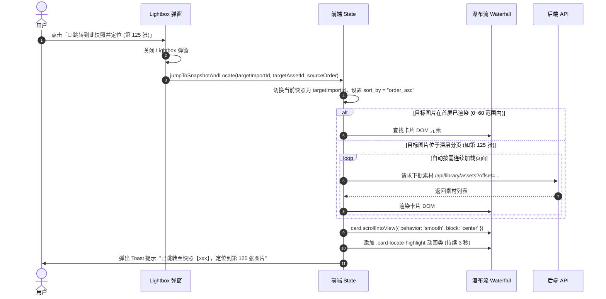

# Web 素材库：图片跨快照归属溯源与一键定位跳转设计

日期：2026-08-30
状态：已确认采用 A-1 方案（侧栏次级页签），待评审后进入实施计划

---

## 1. 背景与业务价值

在日常投稿素材编排与整理过程中，用户经常会通过多种来源（如不同日期的 NeeView 播放列表 `.nvpls`、按角色/主题划分的整理目录等）向 Publishing Workspace 进行增量导入。同一张图片（基于内容 SHA-256 唯一去重）往往会同时存在于多个历史快照（`imports`）中。

目前在素材库瀑布流中打开图片详情（Lightbox 弹窗）时，仅能看到图片在当前视图下的元数据，存在以下痛点：
1. **无法溯源归属**：用户不知道这张图片曾经在哪些快照、哪个批次中被导入过；
2. **缺乏位置上下文**：不知道该图片在目标快照中处于第几张（原始顺序）；
3. **无法快捷跳转**：如果想去某个快照查看该图片前后的上下文系列图，需要手动关闭弹窗、去左侧快照选择器搜索切换快照、再手动翻页查找，流程繁琐。

本设计旨在为 Lightbox 弹窗增加**跨快照归属溯源面板**，并提供**一键直达快照且精准滚动定位**的高效流转能力。

---

## 2. 方案选型与交互设计（Scheme A-1）

### 2.1 整体布局：侧栏次级页签 (Sidebar Sub-Tabs)

在右侧操作栏（⭐收藏、📮已投稿、📂打开文件夹）下方，增加一组紧凑的分段切换页签：
* **`[ 📊 参数与节点 ]`**（默认选中，保持现有参数、节点、Prompt 视图）
* **`[ 📂 关联快照 (N) ]`**（显示关联的快照总数）

```text
┌───────────────────────────────────────────────┬────────────────────────────────────────┐
│ [ comm_seed_177386...png ]                    │   [ ⭐已收藏 ] [ 📮已投稿 ] [ 📂打开文件夹 ] │
│ 路径: D:\AI\design\post\...                   ├────────────────────────────────────────┤
│                                               │ ┌───────────────────┬────────────────┐ │
│                                               │ │ 📊 参数与节点      │ 📂 关联快照 (2)│◄┼─ 点击切换到快照列表
│                                               │ └───────────────────┴───▲────────────┘ │
│                                               │                         │              │
│                                               │ ┌─ 📂 2026-04-04 精选集 ┴────────────┐ │
│                                               │ │ 📑 NeeView 播放列表 · 共 300 张     │ │
│               【 左侧大图预览 】              │ │ 📍 出现位置: 第 42 / 300 张 (#42)   │ │
│                                               │ │ [ 🎯 定位到当前瀑布流位置 ]         │ │
│                                               │ └────────────────────────────────────┘ │
│                                               │ ┌─ 📂 角色图库_Homura ───────────────┐ │
│                                               │ │ 📁 普通文件夹 · 共 1280 张           │ │
│                                               │ │ 📍 出现位置: 第 110 / 1280 张 (#110)│ │
│                                               │ │ [ 🚀 跳转到此快照并定位 ]           │ │
│                                               │ └────────────────────────────────────┘ │
└───────────────────────────────────────────────┴────────────────────────────────────────┘
```

### 2.2 快照卡片信息与状态呈现

在「📂 关联快照」面板中，每个快照卡片包含以下完整信息：
1. **快照名称与来源图标**：
   - 来源识别：NeeView 播放列表（📑）、普通目录（📁）；
   - 名称提取：取 `source_ref` 的文件名/文件夹名，并附带小号 `import_id`。
2. **快照标签与元数据**：
   - 快照所属 Tags 徽章（如 `pixiv`、`selection` 等）；
   - 快照导入时间（如 `2026-04-04 21:02`）与总素材数（`共 300 张`）。
3. **精准位置与序号**：
   - 显示 **`第 X / 共 Y 张 (序号 #X)`**（1-based 友好序号 + 0-based 原始 `source_order`）。
4. **当前浏览状态高亮**：
   - 若该快照正是当前素材库主界面已选中的快照，卡片右上角显示 **`[📍 当前快照]`** 高亮标记。
5. **操作动作按钮**：
   - 若为其他快照：提供 **`[ 🚀 跳转并定位此图 ]`** 按钮；
   - 若为当前快照：提供 **`[ 🎯 在当前瀑布流中定位 ]`** 按钮。

---

## 3. 一键跳转与瀑布流精准定位机制

### 3.1 交互流转时序



### 3.2 深度分页自动直达与视口焦点控制

1. **筛选保护与顺序重置**：
   - 跳转时自动将排序模式重置为 `order_asc`（快照原始录入顺序），并清除可能干扰导致该图片被过滤的临时搜索文本，保证目标图片稳定出现在瀑布流中。
2. **多页连载寻址加载**：
   - 前端维护 `state.loadedAssets`。若目标卡片尚未挂载到 DOM，前端以极速连续分页方式（单批 60 项，本地接口耗时 <10ms）按需载入至目标 `source_order` 所在页，直到目标卡片被实例化。
3. **视觉光圈动画**：
   - 为目标卡片注入 `.card-locate-highlight` CSS 动画：
     ```css
     @keyframes locate-pulse {
       0% { box-shadow: 0 0 0 0 rgba(59, 130, 246, 0.8); transform: scale(1); }
       30% { box-shadow: 0 0 0 10px rgba(59, 130, 246, 0.4); transform: scale(1.03); }
       60% { box-shadow: 0 0 0 16px rgba(59, 130, 246, 0); transform: scale(1.01); }
       100% { box-shadow: 0 0 0 0 rgba(59, 130, 246, 0); transform: scale(1); }
     }
     ```

---

## 4. 后端接口与数据库查询设计

### 4.1 数据查询层 (`CatalogRepository`)

在 `CatalogRepository` 中新增 `snapshots_for_asset(asset_id: str)` 方法：
```python
def snapshots_for_asset(self, asset_id: str) -> list[dict[str, Any]]:
    with self.connection() as conn:
        rows = conn.execute(
            """
            SELECT 
                i.import_id,
                i.source_type,
                i.source_ref,
                i.total_items,
                i.tags_json,
                i.created_at,
                ii.source_order,
                ii.source_path,
                ii.resolved_path,
                ii.display_name,
                ii.status,
                ii.decision
            FROM import_items ii
            JOIN imports i ON i.import_id = ii.import_id
            WHERE ii.asset_id = ?
            ORDER BY i.created_at DESC, ii.source_order ASC
            """,
            (asset_id,),
        ).fetchall()
        
        results = []
        for r in rows:
            tags = []
            if r["tags_json"]:
                try:
                    tags = json.loads(r["tags_json"])
                except Exception:
                    tags = []
            
            ref_path = r["source_ref"] or ""
            name = Path(ref_path).name if ref_path else r["import_id"]
            
            results.append({
                "import_id": r["import_id"],
                "name": name,
                "source_type": r["source_type"],
                "source_ref": ref_path,
                "source_order": r["source_order"],
                "total_items": r["total_items"],
                "tags": tags,
                "status": r["status"],
                "decision": r["decision"],
                "display_name": r["display_name"],
                "path": r["resolved_path"] or r["source_path"],
                "created_at": r["created_at"],
            })
        return results
```

### 4.2 API 响应扩展 (`GET /api/assets/{asset_id}/details`)

在原有接口返回值中无缝扩展 `snapshots` 数组字段：
```json
{
  "asset_id": "sha256:1773862485...",
  "path": "D:/AI/design/post/20260404/comm_seed_1773862485_3974790399_0.png",
  "display_name": "comm_seed_1773862485_3974790399_0.png",
  "width": 832,
  "height": 1216,
  "image_format": "PNG",
  "is_favorited": true,
  "is_posted": false,
  "marks": ["favorite"],
  "tags": [],
  "generation_info": { },
  "snapshots": [
    {
      "import_id": "import-20260404-01",
      "name": "2026-04-04 精选集.nvpls",
      "source_type": "neev_playlist",
      "source_ref": "D:/AI/design/post/20260404/fav.nvpls",
      "source_order": 41,
      "total_items": 300,
      "tags": ["post", "favorites"],
      "status": "ready",
      "decision": "parsed_new",
      "display_name": "comm_seed_1773862485_3974790399_0.png",
      "created_at": "2026-04-04T21:02:32+08:00"
    }
  ]
}
```

---

## 5. 影响范围与修改文件清单

1. **后端数据与服务层**：
   - `src/publishing_workspace/catalog/repository.py`：新增 `snapshots_for_asset` 查询方法。
   - `src/publishing_workspace/web/library_api.py`：在 `/api/assets/{asset_id}/details` 中调用并返回 `snapshots`。
2. **前端结构与样式层**：
   - `src/publishing_workspace/web/static/library.html`：在 `.lightbox-sidebar` 中增加次级页签导航及 `lb-tab-params-content` / `lb-tab-snapshots-content` 容器。
   - `src/publishing_workspace/web/static/library.css`：新增次级页签样式、快照卡片样式、定位按钮及 `.card-locate-highlight` 脉冲高亮关键帧动画。
   - `src/publishing_workspace/web/static/library.js`：
     - 实现侧栏页签切换 `switchSidebarTab`；
     - 在 `renderLightboxCurrent` 中渲染快照列表与状态 Badge；
     - 实现 `jumpToSnapshotAndLocateAsset`，支持跨快照平滑切换、多页按需加载、居中滚动与高亮动画。
3. **自动化测试**：
   - `tests/test_library_api.py`：增加跨快照查询 API 与单张图片多快照关联的单元测试用例。

---

## 6. 验证方案

1. **API 自动化测试**：运行 `pytest tests/test_library_api.py` 确保多快照同图关联能正确返回 `source_order`、`total_items` 与快照名称。
2. **前端多快照交互验收**：
   - 打开同时存在于多个快照的图片，验证页签计数 `📂 关联快照 (N)` 是否准确；
   - 切换至快照页签，验证当前快照是否标有 `[📍 当前快照]`；
   - 点击其他快照的 `[ 🚀 跳转并定位 ]`，验证主界面是否自动切换快照、关闭弹窗、平滑滚动至该图片并出现发光脉冲动画；
   - 点击深层页数（如第 100+ 张）的图片定位，验证是否能自动补全加载并精准居中定位。
